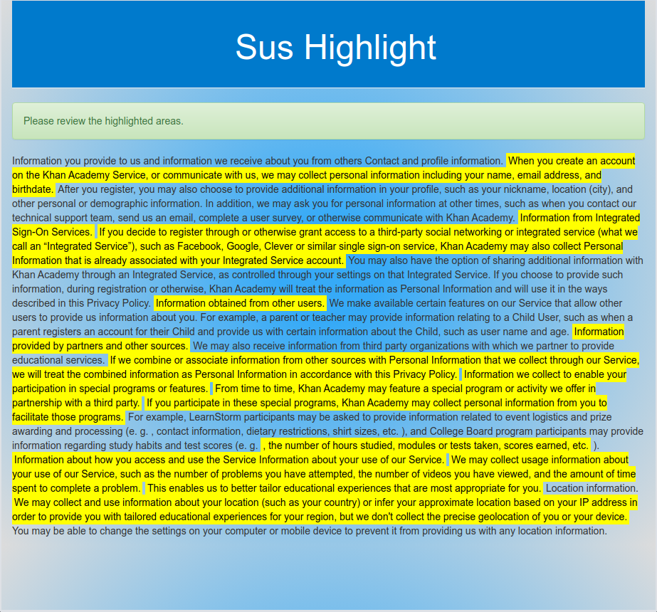

# HackGT20 - Sus Highlight

## Inspiration
One of the most ignored documents is a company’s terms and conditions section. A recurring issue is a person blindly accepting these terms and conditions without reading the fine print. Therefore, this lack of attention to fine details can cause a person to fall into many problems. To combat this problem, our solution is to create a small summary of the details stated in these documents, as well as determining which sections of the document have a positive or a negative effect on the user.
 
## What it does
The user is presented with a website that allows text input. The user is to copy and paste the Terms and Conditions’ text into the textbox provided on the website. The text placed inside the textbox will run through our algorithm. In the end, the algorithm will determine if the given text has a positive or a negative connotation, thus giving the user information about its effect.
 
## How we built it
For the backend algorithm, we are using Python’s open source libraries: scikit, sklearn, nltk, and numpy. Together with these Python libraries, we are able to detect the sentiment of the user’s text. We are able to detect and classify the text into different features by using the Random Forest Classifier. The Random Forest Classifier helped us train datasets so that it is possible to predict the outcome of other datasets obtained from the user. For the front-end, we used Django and its system of populating templated HTML alongside CSS styling.
 
## Challenges we ran into
In the backend, the team was not an expert with natural language processing, so there were many challenges when it comes to understanding how machine learning is able to comprehend which words are considered to have a positive or a negative connotation. Because we weren’t experienced in this topic, the debugging process was long and tedious as we had to familiarize ourselves with the functions provided in the Python libraries.

## Example Output

